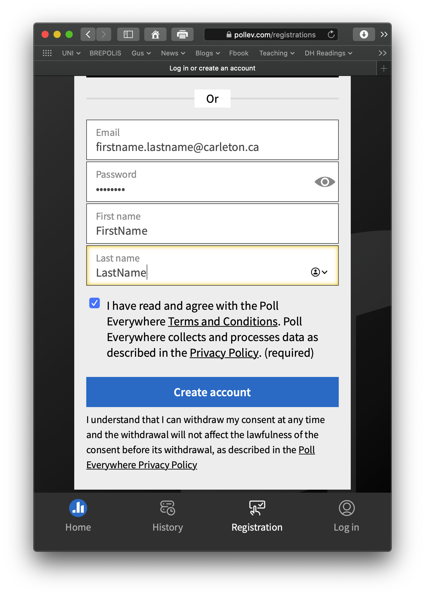

# Poll Everywhere

In class, we are going to use [Poll Everywhere](https://www.polleverywhere.com/). It is a real-time, polling tool that allows you to give instant feedback on questions asked by your professor.

Carleton has a guide to Poll Everywhere  [here](https://carleton.ca/edc/pollev/). 

At the begining of the year I'll send around an email that looks something like this: 

> Hello,
>
> For those of you who haven’t registered for Poll Everywhere before, please check your email inbox for an email from Poll Everywhere with your registration link – this was sent this morning. If you already have an account, then you should be able to access that link \(and other polls to come in class\) by logging in like usual. Let me know if you have any issues though and we’ll sort it out.  
> Please register with Poll Everywhere using [Firstname.Lastname@carleton.ca](mailto:Firstname.Lastname@carleton.ca) not your @cmail.carleton.ca account.   
> Note: there is a period between your first and last name in the @carleton.ca email. This @carleton email address is the one you are registered in cuLearn with and the one you need to use to receive credit for participation in Poll Everywhere. 
>
> For more support, check out additional resources on the [PollEverywhere student FAQ page](https://carleton.ca/edc/pollev/#sect5).

You will be responsible for [signing up for your account](https://pollev.com/registrations), which will look like this:

#### Make sure your email is set to firstname.lastname@carleton.ca

If you have  [firstnamelastname@cmail.carleton.ca](mailto:firstnamelastname@cmail.carleton.ca) and [firstname.lastname@carleton.ca](mailto:firstname.lastname@carleton.ca) email addresses associated with Poll Everywhere, make sure you switch to [firstname.lastname@carleton.ca](mailto:firstname.lastname@carleton.ca) when responding to polls. This will assure the polls you submit track your participation.  

#### Making sure you are a registered participant in a course

If you have not received an invitation to create an account with Poll Everywhere, check with your instructor if you are enrolled into a course in cuLearn. 

#### Downloading the Poll Everywhere mobile app

You can download the [Poll Everywhere mobile app](https://www.polleverywhere.com/support/articles/pollev-mobile/install) if the polls will be frequently used throughout the course, or use a web window. It is free to download the app in Google Play and the Apple App Store. Make sure you log in using your [firstname.lastname@carleton.ca](mailto:firstname.lastname@carleton.ca) in your app. The mobile app will help you to access your Poll Everywhere account in a more convenient way by staying logged in.

