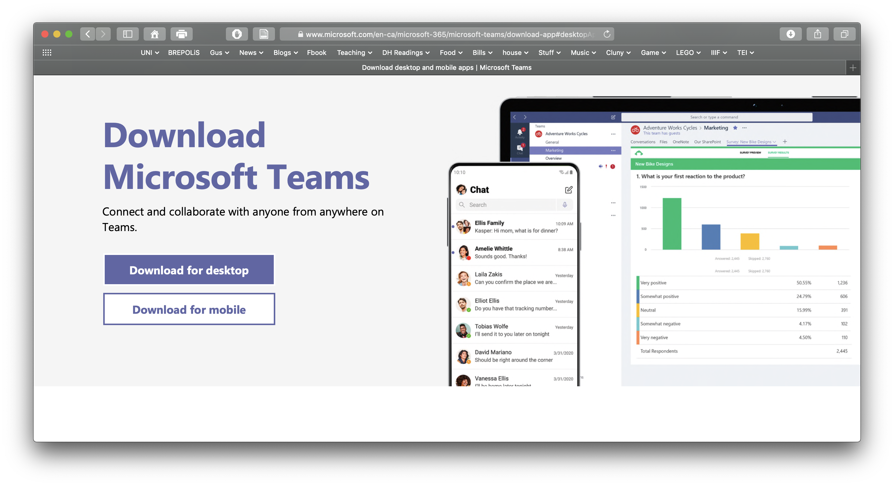
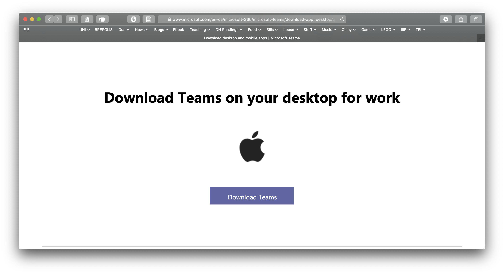
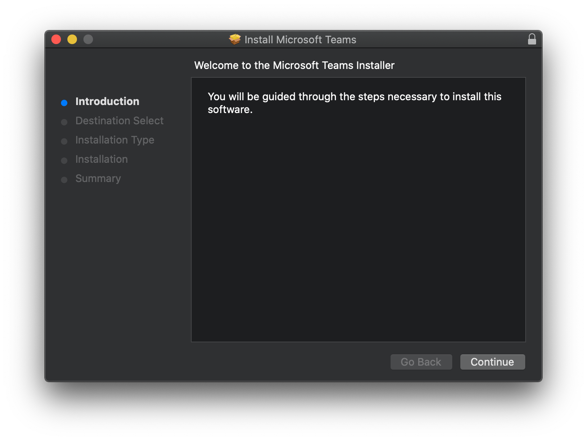
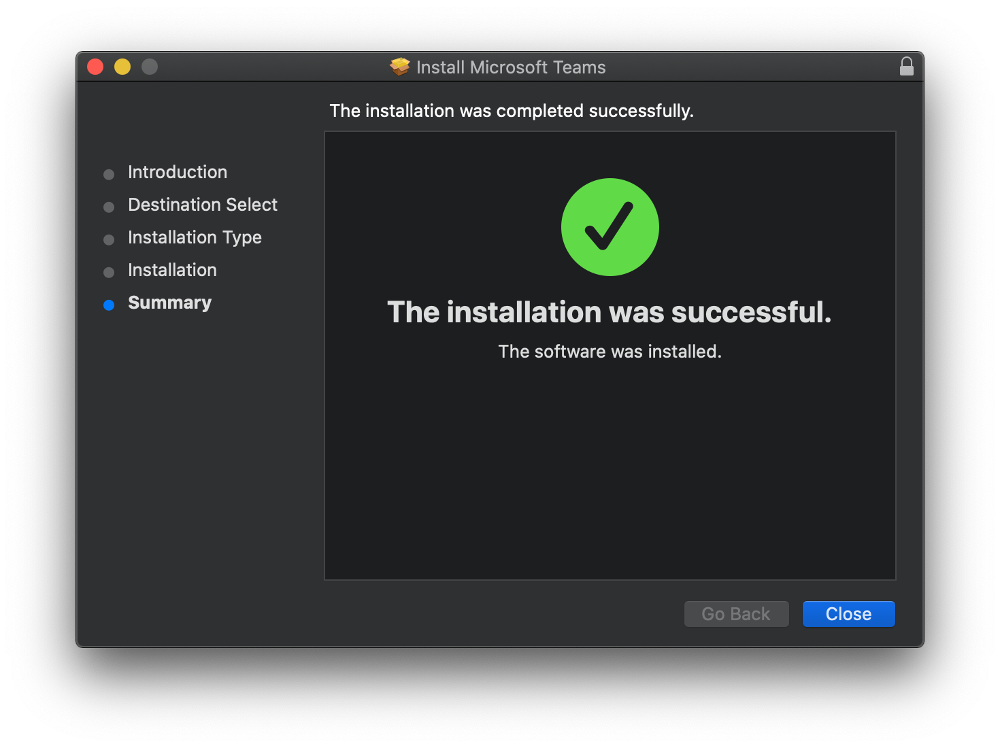
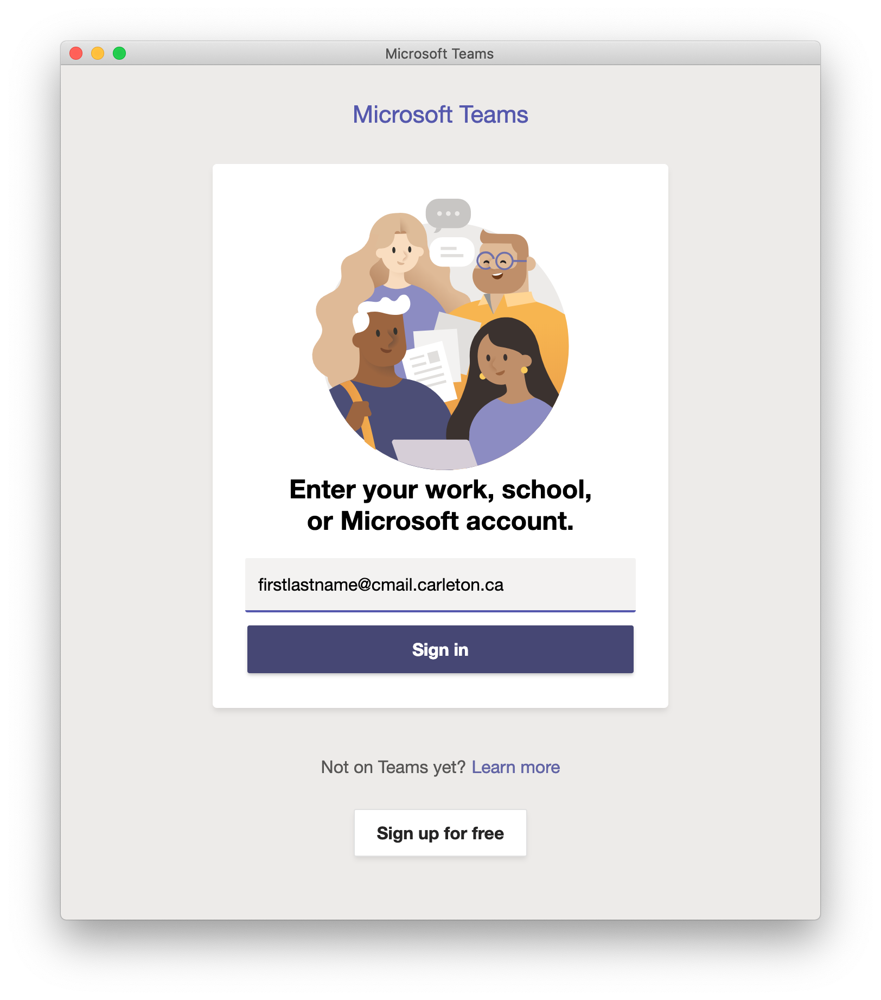
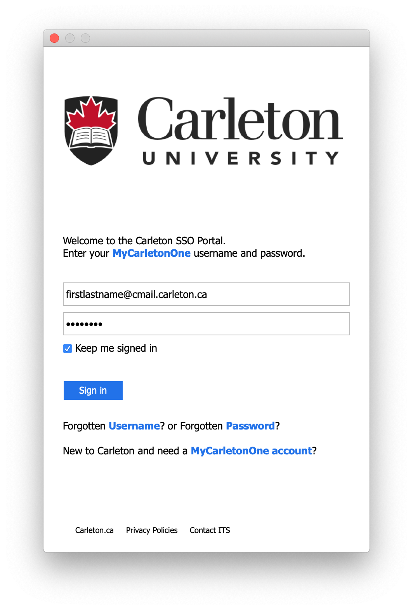
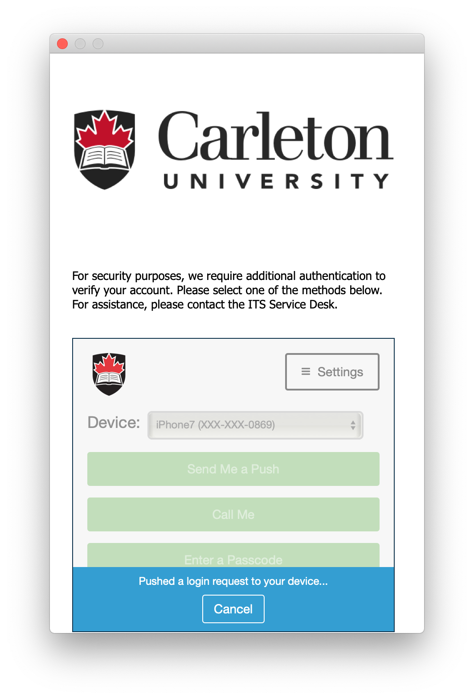
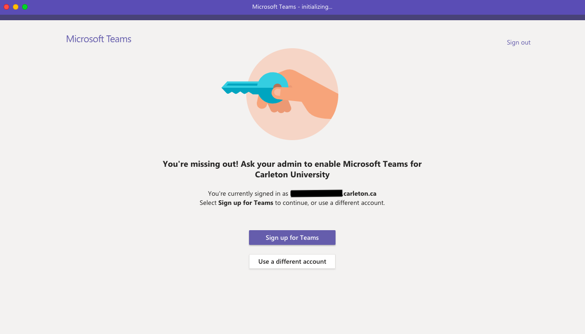

# MS Teams

### What is Microsoft Teams?

_**Teams**_ is one of the many "enterprise tools"  you will be using \(i.e. digital tools/ apps that businesses use to manage projects and keep in communication\). We're adapting it to the educational environment to take advantage the relative ease of communication that it provides. Ideally, it will be a digital hub connecting different parts of the course. I hope that Teams makes it easy for you to get in contact with the professors, teaching assistant\(s\) and your fellow students. It also works on computers, mobile devices and most browsers so you can keep in contact with the class through the form of connection you want \(mobile app, desktop software, email, texts...\). 

### Installing Microsoft Teams on a Desktop


You can also install no software at all and just use Teams through a browser – this is not a great option since you have to sign in again and again. Generally you do less with more hassle. Also, if you are a Mac/ iPhone user, Teams does not work with Safari \(e.g. at all, just blocks it...\). 


1. So, you've likely already installed MS Office 365. You might think you don't need to install Teams separately but you do. Getting your Office licence working doesn't mean it works for Teams. Sigh, microsoft. 
2. Now, Carleton ITS has instructions on how to install Teams. You can see if you can follow along with their instructions, [here](https://carleton.ca/its/teams/download-app/). You fall into the category of "unmanaged PC" or Mac. 
3. If you don't want to click to that page, install Teams our way. You can download mobile or desktop versions for most operating systems at the Canadian Microsoft site: [https://www.microsoft.com/en-ca/microsoft-365/microsoft-teams/download-app](https://www.microsoft.com/en-ca/microsoft-365/microsoft-teams/download-app) 
   1. Direct link for Apple's iOS \([App Store](https://itunes.apple.com/app/id1113153706)\)
   2. Direct link for Android devices \([App Store](https://play.google.com/store/apps/details?id=com.microsoft.teams)\)
4. If you click on the [first link](https://www.microsoft.com/en-ca/microsoft-365/microsoft-teams/download-app) it will take you to this page: 

5. Click on the "Download for Desktop" and it will automatically identify what operating system you are using and give you a link to appropriate downloads. Click on "Download Teams". I'm using a Mac \(so it has a Mac icon\). This will start the download. 

6. Install the program as you normally would and then start it up. I installed it on my mac and an installer automatically opened up. I blindly agree to anything it demanded without reading the conditions...

7. Next you need to open up Teams after install and it will ask you for your Carleton email address. It will be something like "firstnamelastname@cmail.carleton.ca". **DON'T** use your "firstname.lastname@carleton.ca" address – that would mess everything up royally.

8. Now we have now reached the stage where things might diverge for you from my experience. Since I've already signed into Teams before, even when I install it on a new machine it takes me directly to a Carleton sign-in \(as if you were signing into your student account\) and then the Duo two-factor authentication. 

BUT if this is your first time signing into Teams, you will likely encounter some roadblocks before getting to this stage. After you enter the CORRECT Carleton email in step 7 \(above\), Microsoft might not recognize you. And you might encounter something that looks like this window, which says, "You're missing out! Ask your admin to enable Microsoft Teams for Carleton University":

So this is a bit confusing, becuase your Carleton IT admins have enabled Microsoft Teams for Carleton students. So what you need to do is click on that button, "Sign Up for Teams". It might take you to another page where you enter the same "cmail" Carleton email address you did before, and follow their instructions. Then, the Microsoft website should then send you back to the Carleton email authentication page \(above step 8\) to finalize everything. 

 Or it might just keep sending you back to this message recursively. I would love to write this section up with screen shots for you, but I can't ... because I already did this stage before I realized I would need to explain this to other people. So try two things:

1. You might need to enable additional Office365 features. Carleton has instructions on how to do this on this webpage \([https://carleton.ca/its/o365/unsupported/](https://carleton.ca/its/o365/unsupported/)\), where they declare \(most forcefully, I do declare\): 

**YOU MUST ENABLE O365 SERVICES \(other than email, which is enabled by default\)**  
  
To **enable** Microsoft Office 365 Services, \(other than email which is pre-enabled\), accept Microsoft’s offer here:

* **Students**: [carleton.ca/its/ms-offer-students](https://carleton.ca/its/ms-offer-students)
* **Staff/faculty**: [carleton.ca/its/ms-offer-faculty](https://carleton.ca/its/ms-offer-faculty)

 2. If that doesn't work, email its.service.desk@carleton.ca for help.

### Using Teams

If you haven't used it before \(and I haven't before May of this year\) Teams will take a bit of getting used to understand how it works best. 

Watch a video about what it is. Microsoft adds lots of touching music and feel good images to make you think that it will solve all your problems. It won't but, they do give you a bit of a sense on how to use Teams. 

Download a PDF "[Quick Start Guide](https://edudownloads.azureedge.net/msdownloads/MicrosoftTeamsforEducation_QuickGuide_EN-US.pdf)" to understand how Teams works. 

Go to the next page for more information about how to use Teams for this class. 


Microsoft is pushing Teams in 2020 as their videoconference/ teaching solution because of the deperate need of schools, universities and government to quickly adopt a distance-learing "solution". It keeps getting updated and new functionalities appear frequently, so what it can do/ how we can use it might change over the course of our class.  


