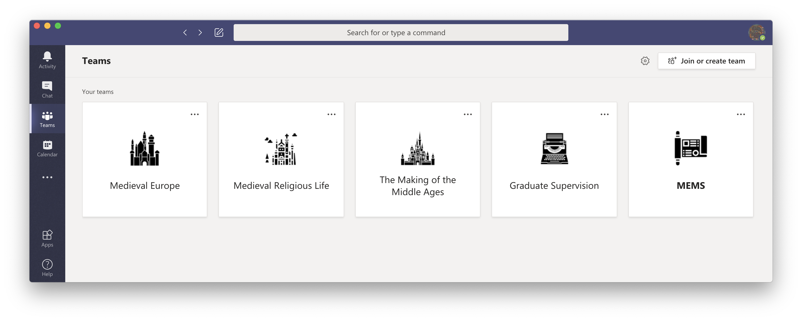
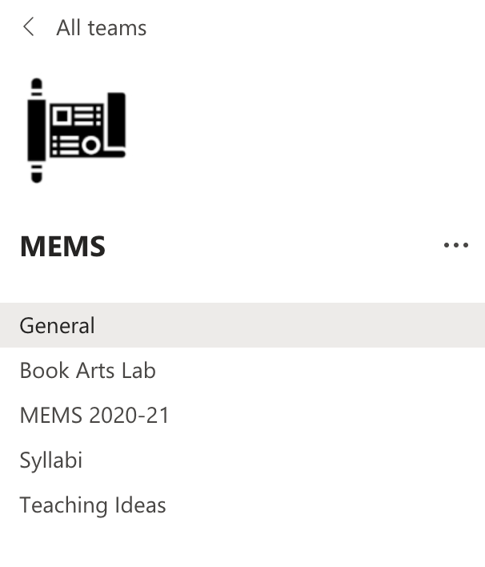
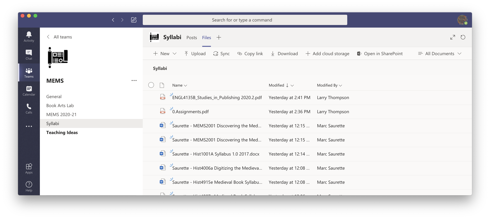
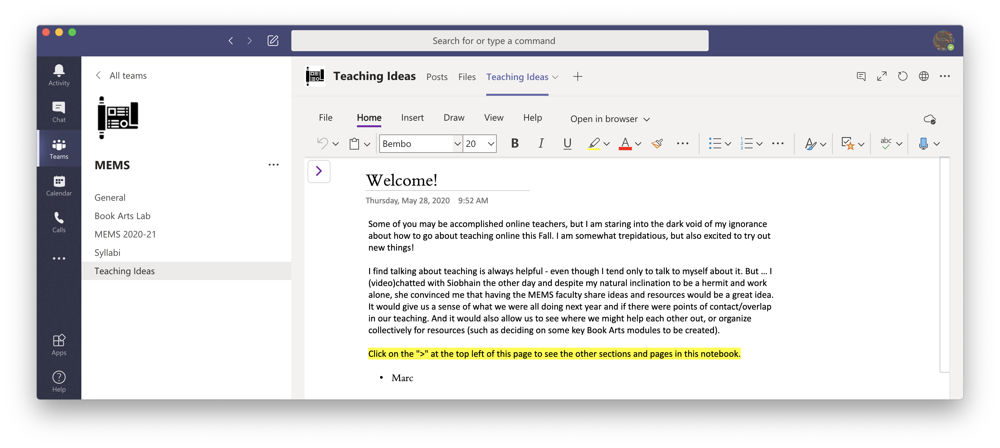
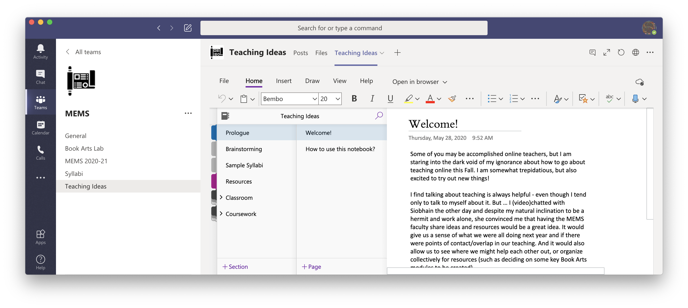
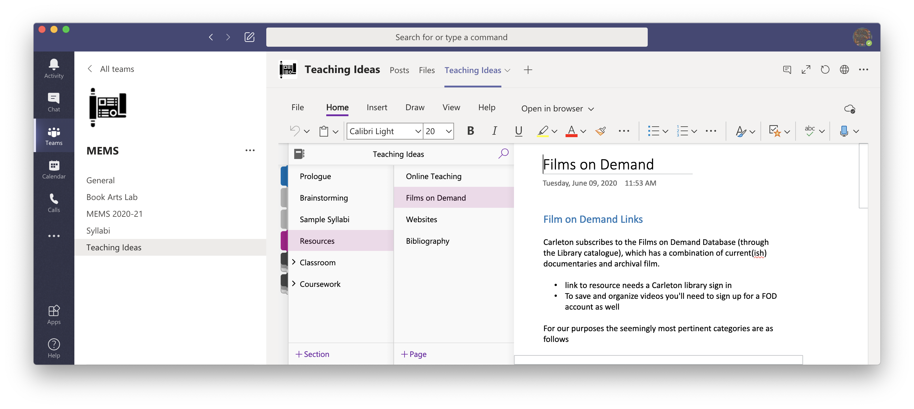
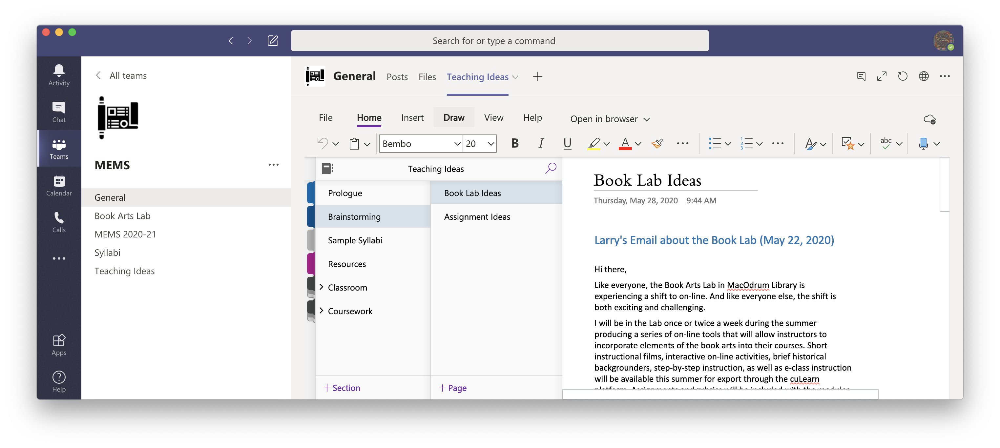

# \(really\) Short Guide to MS Teams


The images in this guide may not look like the Teams "team" that we will be using in class. They are meant more as a general introduction and explanation.


Teams integrates many different aspects of the Microsoft software environment, but organizes them in new and different ways. They are continually reworking the interface in light of the huge movement to online teaching/ digital communiting as a result of Covid-19. So, depending on when you access this page, things may have changed. 

I'm \(Marc Saurette\) writing this up after only a few weeks of using it, so I am still figuring most things out. Microsoft has loads of tutorials/ webinars on their site, which I recommend. 


One thing I have discovered about using Teams at Carleton is that there are many restrictions about how we can use it, so there is a disconnect between what is shown possible in Microsoft tutorials and what Carleton will allow. For example, faculty must request that new Teams be created by our IT staff \(students cannot make this request yet\) and they will not create Teams from the "Classroom" template \(for some policy reason\).


### Case Study: MEMS teaching collaboration Team

In the summer of 2020, a group of Carleton faculty in the field of Medieval and Early Modern Studies decided to establish a digital collaborative space to faciliate the switch to online teaching for that Fall. We choose to use Teams for its potential to allow \(after installation\) relatively easy group collaboration, file sharing and so on. 

Once you have installed Teams on your desktop, your home screen will be blank. Once you have created or joined different teams, it will look something like this: 

There is a left hand sidebar, that allows you jump between things like "Chat" \(which is a form of direct messaging intended for private chats –max 20 recipients\), your calendar \(which imports from your Outlook/ Exchange account\), and Teams. Click on the Teams icon. 

* If I have already added you to the Team, then you should see the MEMS team open to you. Click on it and you're in. 
* If I haven't added you already, click on the button in the right hand corner, "Join or Create Team". NB: You can't create a Team due to Carleton's policy. I lost a day figuring that out...
* If you click on that button, you will be prompted to enter a code that I will send around privately \(It was sent out on the MEMS listserv already\). Entering the code should take you to the MEMS Team, which looks something like this:

So, first thing to note. Teams encourages you to "get the conversation started". They call this open discussion forum a "conversation" \(to make it distinct from "chats" which are private\). 

Second thing to note is that there is now a new sidebar visible, just devoted to the MEMS team. Under the title and icon in this second sidebar,  different "Channels" are listed.

In this example, we have five channels, the first \(a default\) named "General" and other channels devoted to thinking about ideas for the Book Arts Lab, posting MEMS 2020/21 courses, sharing syllabi and general Teaching Ideas brainstorming/ resources sharing. The idea behind these channels is that people need only subscribe to the channels that interest them \(i.e. MEMS faculty who don't want to worry about the Book Arts Lab could "hide" that channel to avoid notifications about it\).

There is also a new topbar:

Each channel has the possibility of using their own top bar to add distinct "Tabs". These are essentially integrations with other Microsoft software. In the General Channel, we can see that the "Posts" tab opens by default for conversations, the "Files" tab leads you to any files that have been uploaded to that channel \(drag & drop\), and here "Teaching Ideas" takes you to a OneNote notebook. 

The OneNote notebook \(I think!\) can be edited by all of us. It has the potential to organize resources and ideas we share in order to create a potential archive. 

If you click on the "&gt;" on the top left corner of the notebook, it opens up a table of contents:

And you can navigate to other pages in the Notebook quickly:

The notebook \(currently entitled, "Teaching Ideas"\) can be accessed both from the General and the Teaching Ideas channel. I've also created a page for Book Arts Lab brainstorming in the notebook:

Generally, if we wanted to write something collaboratively, Notebook allows that to happen. That said, we can also just post resources to our "conversations" and then search for ideas in Teams when we need to \(this is the easier option, but less organized, I guess\). 

So I'll maybe stop there for now. Let me know if there are other things to make clear. There are many many other things to explore for collaboration. I'm testing out different things to use in prep for fall teaching and seeing what can/ can't be done. 

* Microsoft has released "Whiteboard" which works pretty well for jotting down notes like on, well, a whiteboard and sharing with others. It installs on mobile devices and is accessed via browsers \(but not Safari\) on computers. 
* And I haven't talked at all about how to organize video-conferencing for teaching, but Microsoft has that covered pretty well ....

