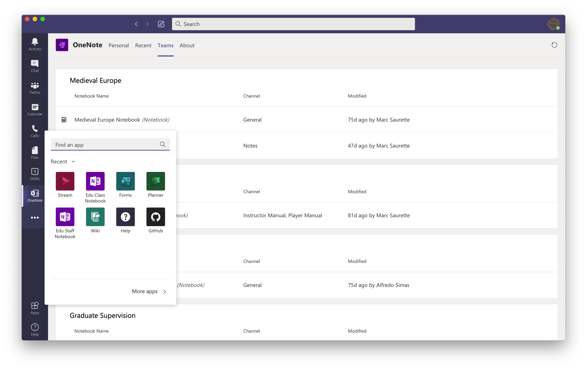
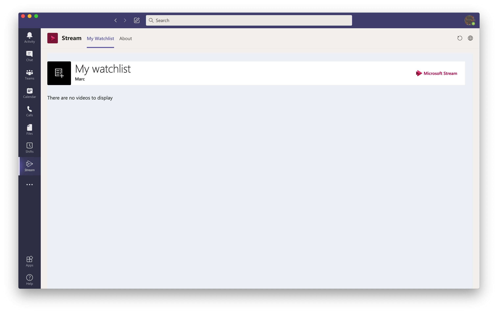

# Streaming Lectures

Something we might experiment with is recording the lectures, warts and all. If this is something that interests you, the lectures will be available via MS Streams. 

1. Open up MS Teams
2. Find the leftmost sidebar, and click on the elipsis \(...\) on the bottom.

3. Click on Stream and a window of class recordings should pop up. 

4. Enjoy the Greatest Hits presented there on your own time...

