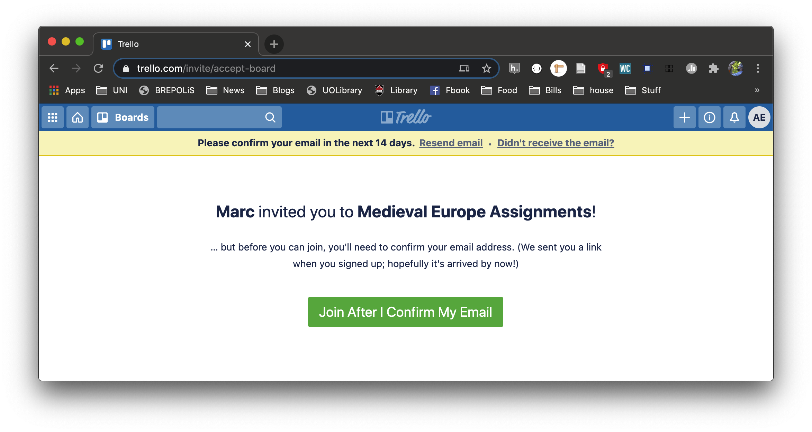

# Trello

### What is Trello?

Trello is a digital task management platform based on the [Kanban Board](https://en.wikipedia.org/wiki/Kanban_board) model.

Kanban Boards are a workflow visualization tool that today is mostly utilized in the computer programming world. Kanban translated from Japanese means “signboard” or “billboard.” The Kanban method was first developed in the 1940s for the newly developed [Toyota Production System](https://www.toyota-global.com/company/vision_philosophy/toyota_production_system/origin_of_the_toyota_production_system.html) in order to build vehicles based on customer demand to avoid excessive inventory. It was adopted by software developers in the last few decades and more recently for use by educators. 

For an explanation on kanban boards can be used for university, take a look at John Derian's article, "[The Ultimate Team Work Management Tool: Kanban Boards](https://www.pblworks.org/blog/ultimate-team-work-management-tool-kanban-boards)". He talks about a paper model, but we'll be using a digital version on Trello. He notes that using kanban boards in classes for collaborative \(and self-directed\) work, have many benefits:

* Helps students plan and discuss their work as a team
* Helps students see how the daily work is leading towards the culminating product/ task/ event
* Helps students identify what to work on next once a task has been completed
* Holds individuals accountable to their team work.
* Helps students see their progress and take pride in their work.

I hope that in our online class we can use the digital kanban Trello to reap these same benefits. 

### Video Tutorials on Trello

* [A Quick Overview of Trello](https://youtu.be/tVooja0Ta5I)
* [Getting Started with Trello \(YouTube](https://youtu.be/xky48zyL9iA)\)

### How to Sign up for Trello

In Trello, I have formed a Team entitled, "Medieval Europe" which I will ask you to join. Via Teams, I will send you a link to join the team which will allow you to copy a pre-made Trello board to allow you to keep track of your assignments.

1. Click on this link to sign up for a Trello account: [https://trello.com/marc09832755/recommend](https://trello.com/marc09832755/recommend)
2. Trello will ask you to sign in and complete a mini-tutorial, which will look something like this:

In the next page, I explain how to use kanban style boards to manage your time/ work. And in the page after that, I provide an introduction how to copy and use the "Medieval Europe Assignments" Trello board. 

