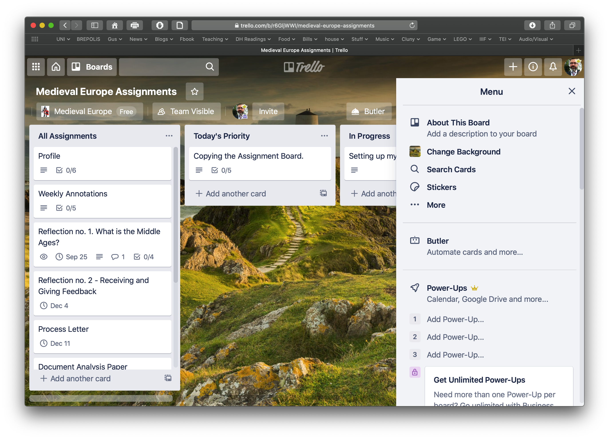
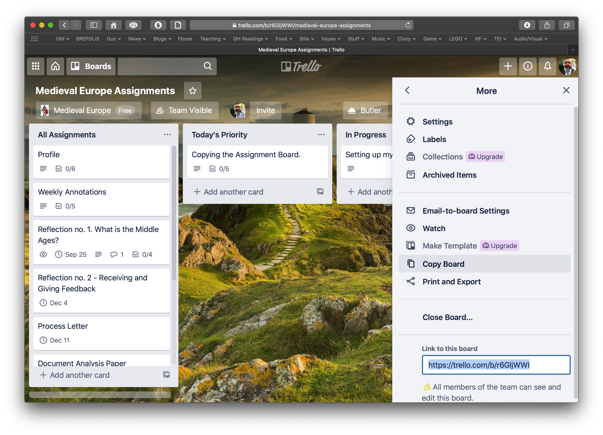
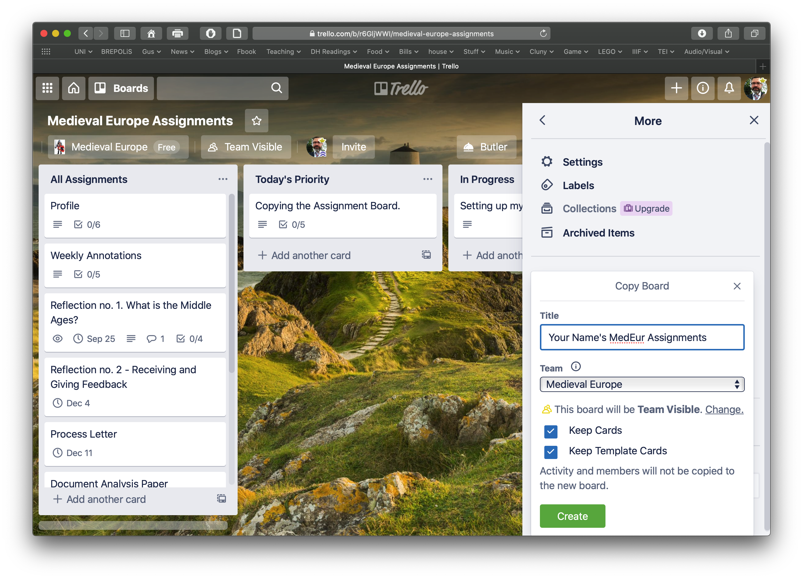
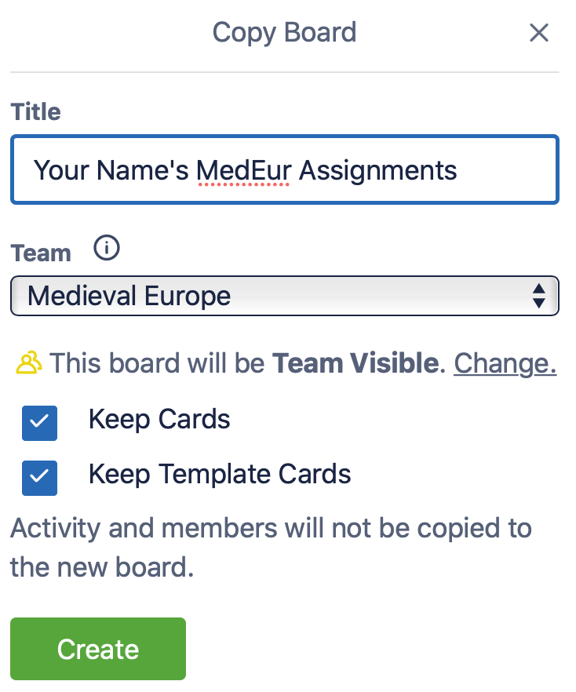

# Keeping Track of Assignments with Trello

### Read

Make sure you have read through the following pages and followed the instructions there to sign up for Trello and for our Trello Group. 





### What to do

After you have signed into our "Medieval Europe Assignments" board \(instructions in the pages above\) you should copy and rename it for your personal use.‌

1. Navigate to the board: [https://trello.com/b/r6GljWWI/medieval-europe-assignments](https://trello.com/b/r6GljWWI/medieval-europe-assignments)​
2. Make sure you're signed in to your account and you've already joined [our group](/@marc-saurette/s/medieval-europe/digital-tools/trello#how-to-sign-up-for-trello).
3. ​The Trello page will look something like this:

4. To copy, click on the button "Show Menu" in the upper right corner.

5. Then click on the elipsis \(... More\) and it will open up a further menu. 

6. Click on the "Copy Board" option, which will give you options to rename it. You must rename it with something so that it is recognizably yours \(i.e. your name or a nickname/pseudonym you have already agreed upon with your professor so they can tell who is who. 

It is important that you allow your board to be "Team Visible" so that your professor can see it. 

8. And you're done! Thanks. Now you can start using it to plan how to organize your time....

