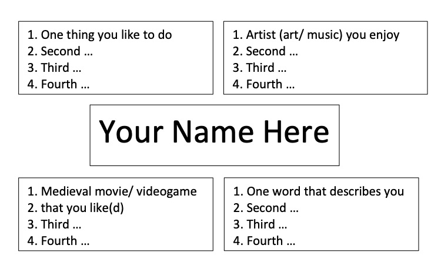

# Week 1 Icebreaker

For our first week, we'll open an activity to get to know each other. Imagine yourselves as if we're in class, awkwardly avoiding everyone's eyes in case you feel compelled to say something. 

Well channel that feeling of awkwardness into introducing yourself online, which is arguably just as weird to do. 

....

