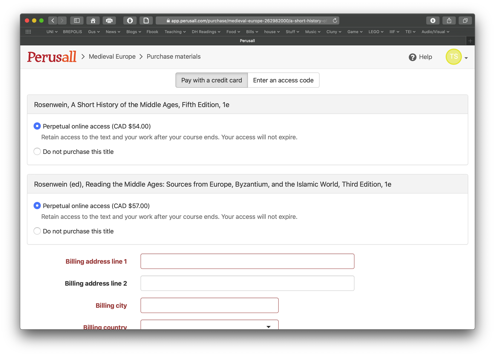

# Textbooks

I am trying something new this year for our textbooks. Instead of having the bookstore order physical books to campus \(which I am not sure if you are going to be nearby\), we will instead use digital textbooks which we will read and annotate together via [Perusall](https://app.perusall.com/).  Perusall allows for [social annotation](http://www.grandviewcetl.org/tools-for-teaching-social-annotation/) which will be a key part of our learning experience this year. You have other options to get textbooks \(listed below\) but you will not be able to participate in the social annotation which is a key part of your work this year.  

### Logging-in to Perusall

To login to Perusal for our course, 

1. Navigate to [https://app.perusall.com/](https://app.perusall.com/)
2. Click on the "Enroll in Course" button
3. Enter the code: SAURETTE-Y4NNP
4. You will be able to see our two textbooks under the "Library Tab". 

5. Click on the "Open" button underneath either of the textbook descriptions on the rightside of the page and it will take you to an option to purchase the textbook online \(with a credit care or code\). 

### Our textbooks: 

We will be using two textbooks written by esteemed medievalist Barbara Rosenwein:

Barbara Rosenwein, [_A Short History of the Middle Ages_](https://utorontopress.com/ca/a-short-history-of-the-middle-ages-fifth-edition-2)_._ 5th edition. Toronto: University of Toronto Press, 2018. ISBN 9781442636224

Barbara Rosewein, ed.[ Reading the Middle Ages](https://utorontopress.com/us/reading-the-middle-ages-10). 3rd edition. Toronto: University of Toronto Press, 2018. ISBN 9781442636736

We choose these textbooks because Rosenwein provides an up-to-date account of the medieval world and provides a diverse range of sources in the companion volume.  They are printed on good quality paper and have loads of illustrations and maps. Since HIST 2000 is a full-year course, we are using the "combined editions". 

### How to Get Textbooks

Please buy our textbooks via [Perusall](http://apps.perusall.com).

If you click on the links in the textbook titles \(above\), it will take you directly to the UTP website where you can buy them. Ebook versions will run you over 110$ \(54+57$\) and paperback will be about 140$ \(67+70$\). You can also buy these books from other places, such as [Bookshop.org](https://bookshop.org) \(which allows you to order new books from local independent booksellers\) or used from [AbeBooks](https://www.abebooks.com) \(which started out as a Canadian company \[Advanced Book Exchange\] linking Used Book Sellers, but is now owned by Amazon\). 

Sometimes price comparison can help - check out [isbns.net](http://www.isbns.net/) to find textbooks online: our textbooks are [here](https://www.isbns.net/isbn/9781442636224/) and [here](https://www.isbns.net/isbn/9781442636736/). Simply enter the ISBN and it will search online for all the different prices of that particular textbook. Be careful when buying books from the USA and UK since there might be added shipping and customs duties or shipment delays. The earlier you buy, the cheaper you can go generally. When I price checked the textbooks in May \(2020\), the cost was not significantly cheaper than buying from UTP directly. 


When buying the textbooks, be sure to double check the [ISBN](https://en.wikipedia.org/wiki/International_Standard_Book_Number)'s cited above \(ISBN = International Standard Book Number\). There are many different versions of the textbooks - different editions are printed at different times contain different text. Out textbook also comes in a  split version, since many universities might only offer half courses \(e.g. Early Medieval Europe\) instead of a full-year course. Don't get only half the textbook you will need...


If buying textbooks represents a financial hardship for you \(they are expensive, especially when you add up all the textbooks in all your courses\), please think about applying for a bursary \(a monetary award that is granted on the basis of financial need\) to help out with the cost. Carleton's office of Awards and Financial Aid provides a list of bursaries and instructions for [completing an application](https://carleton.ca/awards/bursaries/returning/). If the process seems overwhelming, [contact them directly](https://carleton.ca/awards/contact-us/) for help and they can coach you through the process.  

